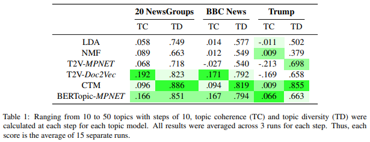
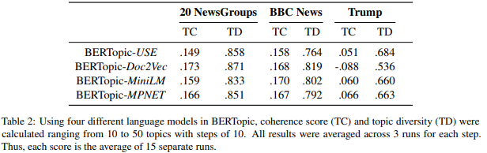
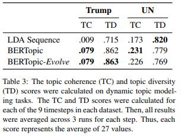
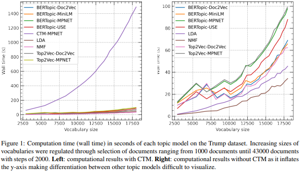

- [BERTopic](#bertopic)
- [정리](#--)
  * [1. Introduction](#1-introduction)
  * [2. Related Work](#2-related-work)
  * [3. BERTopic](#3-bertopic)
    + [3.1 Document embeddings](#31-document-embeddings)
    + [3.2 Doucument clustering](#32-doucument-clustering)
    + [3.3 Topic Representation](#33-topic-representation)
  * [4. Dynamic Topic Modeling](#4-dynamic-topic-modeling)
    + [4.1 Smoothing](#41-smoothing)
  * [5. Experimental Setup](#5-experimental-setup)
    + [5.1 Datasets](#51-datasets)
    + [5.2 Models](#52-models)
    + [5.3 Evaluation](#53-evaluation)
  * [6. Result](#6-result)
    + [6.1 Performance](#61-performance)
    + [6.2 Language Models](#62-language-models)
    + [6.3 Dynamic Topic Modeling](#63-dynamic-topic-modeling)
    + [6.4 Wall time](#64-wall-time)
  * [7. Discussion](#7-discussion)
    + [7.1 Strengths](#71-strengths)
    + [7.2 Weaknesses](#72-weaknesses)
  * [8. Conclusion](#8-conclusion)

## 1. Introduction

1. 기존의 클러스터링([Latent Dirichlet Allocation](https://www.jmlr.org/papers/volume3/blei03a/blei03a.pdf) - LDA, [Non-Negative Matrix Factorization](https://arxiv.org/abs/1010.1763) - NMF) 은 문서를 Bag-of-words(BOW)로 묘사하고 각 문서를 잠재되어 있는 토픽의 혼합물로 묘사함
2. BOW로 문서를 representation하는 모델들의 한계점은 단어간의 의미적 연관성을 무시함, 이런 representation들은 문장에서 단어의 맥락을 설명하지 않기에 BOW는 문서를 정확하게 나타내지 못할 수 있다.
3. 이러한 문제들에 대한 해답으로(2번) NLP 필드의 text embedding 기술이 인기를 얻고 있다.(의미적 연관성을 포함함)
    1. 좀 더 구체적으로 [Bidirectional Encoder Representations from Transformers](https://arxiv.org/abs/1810.04805) (BERT) 와 그것의 variation 모델들이 단어와 문장의 벡터 representation을 생성하는데 좋은 결과를 얻고 있다.
    2. 이런 벡터 representation의 의미적 속성은 텍스트를 벡터 공간에서 유사한 것은 가깝게 인코딩 한다.
4. Embedding 기술은 분류에서 neural search engine에 이르기까지 다양한 분야에서 사용되어 졌지만 (최근들어) 연구자들은 이러한 기술을 토픽 모델링에 사용하기 시작했다. 
    1. [Sia et al. (2020)](https://arxiv.org/abs/2004.14914)은 LDA와 같은 기존 방법과 비교해서 Centroid-based 클러스터링 임베딩의 가능성을 보였다. 
        1. 클러스터 임베딩에서 토픽 representation은 임베딩된 단어들에서 클러스터의 중심부에 가까운 단어를 찾아냄으로 추출되었다.
    2. [Top2Vec](https://arxiv.org/abs/2008.09470)은 Doc2Vec의 단어와 문서 representation을 활용하여 공동으로 임베딩 토픽, 문서, 단어 벡터들을 학습한다.
        1. Sia et al. (2020)의 접근법과 비교하였을 때 문서는 클러스터링이 되고, 토픽 representation은 클러스터들의 Centroid 부분에 가까운 곳에서 추출 되었다.
        2. 토픽 추출은 Centroid-based의 관점에서 생성되지만 클러스터는 밀도 기반(HDBSCAN)을 활용하여 생성함
5. 앞에 설명한(4)의 모델링 기법들은 클러스터의 중심에 가까운 단어가 해당 클러스터의 가장 대표적인 단어라고 가정하고 그에 따라 토픽을 나타냄, 하지만 클러스터는 항상 구의 형태를 가지고 있지는 않음. 따라서 모든 문서 클러스터에 대한 가정과 해당 클러스터의 표현에 대한 가정은 유지되지 않고, 추출된 토픽이 잘못 추출될 가능성이 있음.
    1. Sia et al. (2020)은 클러스터의 빈도에 따라 토픽을 re-rank 함으로 해결하려고 하지만 초기의 토픽 후보군이 여전히 Centroid-based로 추출 되었다는 한계를 가짐
6. 본 논문에서 클러스터링 기술과 TF-IDF의 클래스 기반 variation을 활용하여 일관된 토픽 representation을 생성하는 BERTopic을 제안
    1. 문서의 정보를 포함하는 PLM(즉 Sentence-bert)을 활용하여 문서의 embedding을 만듬
    2. 각각 다른 주제를 나타내는 의미론적으로 유사한 문서 클러스터를 만들기 전에 문서의 임베딩의 차원을 줄인다.
    3. Centroid-based의 관점을 극복하고, 각각의 토픽을 추출하기 위해 TF-IDF의 class-based version을 개발
    4. 이 과정을 통해 다양한 케이스에서 사용할 수 있는 dynamic topic modeling과 같이 유연한 토픽 모델을 사용할 수 있다. 

## 2. Related Work

1. 최근 몇 년 동안 신경 토픽 모델(neural topic model)은 기존의 토픽 모델 기법을 개선하기 위해 신경망을 활용하는 데 점점 더 성과를 내고 있다.
2. LDA와 같은 고전적 모델에 단어 임베딩의 통합은 이러한 강력한 representation을 활용 할 수 있는 가능성을 보여줌
3. LDA와 결합한 모델에 앞서서는 임베딩 기반 모델링의 기술의 가능성을 보여주는 토픽 모델링 기법이 급증
4. 예를 들어 [CTM](https://arxiv.org/abs/2004.03974)은 PLM에 기반하는 이점, 즉 언어 모델의 향후 발전이 더 나음 토픽 모델로 변환 될 수 있음을 보여줌
5. 여러 접근법이 단어와 문서 임베딩을 클러스터링하여 토픽 추출 프로세스를(topic buliding process) 단순화 하기 시작했다.

→ BERTopic은 클러스터링 임베딩 방식으로 만들어지고, 토픽 representation을 생성하기 위해 TF-IDF의 class-based 변형을 통합하여 확장한다.

## 3. BERTopic

- BERTopic은 토픽 representation을 3단계에 걸쳐 생성한다.
    1. 각각의 문서를 PLM을 사용하여 임베딩으로 변환한다.
    2. 변환된 임베딩을 클러스터링 하기 전에 클러스터링 프로세스를 최적화 하기 위하여 차원을 축소한다.
    3. 마지막으로 TF-IDF의 class-based 변형(c-TF-IDF)을 통하여 문서의 클러스터로 부터 토픽 representation을 추출한다.(extracted)

### 3.1 Document embeddings

1. BERTopic에서는 의미론적으로 비교할 수 있는 벡터 공간에 representation을 만들기 위해 문서를 임베딩한다. 동일한 토픽을 포함하는 문서가 의미론적으로 유사하다고 가정한다.
2. 이 임베딩 단계를 수행하기 위해 BERTopic은 Sentence-BERT(SBERT)를 사용
3. 그러나 이 임베딩은 주로 의미론 적으로 유사한 클러스터에 사용되지만 직접적으로 **토픽**을 생성하는데 사용하지는 않는다.
4. 다른 임베딩 기술이 쓰일 수도 있다.(클러스터링을 목적으로) 만약 LM의 문서 임베딩이 의미론적 유사성(semantic similarity)에 fine tuned된 경우 결과적으로, 새롭고 개선된 언어 모델이 개발됨에 따라 BERTopic의 클러스터링 품질이 향상 될 것

→ 즉 BERTopic은 임베딩 기술의 현재 상태에 따라 지속적으로 성장할 수 있다.

### 3.2 Doucument clustering

1. 데이터의 차원이 증가하면 가장 가까운 데이터 지점까지의 거리가 가장 먼 데이터 지점까지의 거리에 접근하는 것으로 나타남, 그 결과 고차원 공간에서는 공간적 지역성의 개념이 잘못 정의되고 거리 측정값의 차이가 거의 없다.(말은 어렵지만 차원의 저주이야기)
2. 이러한 차원의 저주를 피하기 위한 클러스터링의 접근법들이 존재하지만, 가장 간단한 방법은 차원을 줄이는 방법이다.
3. PCA, t-SNE가 차원을 줄이기 위해 가장 잘 알려진 방법이지만, UMAP은 높은 차원의 데이터가 낮은 차원으로 projection 되었을 때 가장 특성이 잘 보존 되는 것으로 알려졌다.
    1. 또한 임베딩 dimension에 대한 계산 제한이 없기 때문에 UMAP은 dimension이 다른 언어 모델에 걸쳐 사용 가능하다.
    2. 그러므로 [UMAP](https://arxiv.org/abs/1802.03426)을 3.1에서 생성된 임베딩 dimension을 줄이는데 사용한다.
4. 줄여진 차원은 [HDBSCAN](https://arxiv.org/abs/1705.07321)을 통해 클러스터링 된다.
    1. HDBSCAN
        1. 밀도기반의 클러스터링
        2. DBSCAN의 확장 버전, DBSCAN의 계층적 클러스터링 알고리즘으로 변환
        3. 다양한 밀도의 클러스터를 찾음
        4. 노이즈를 아웃라이어로 모델링 할 수 있는 소프트 클러스터링 (소프트 클러스터링:한 데이터가 두 개 이상의 군집에 속할 수 있음)
        5. 관련 없는 문서가 클러스터에 할당되지 않음
        6. 주제 표현이 향상 될 것으로 예상
        7. UMAP으로 차원을 줄이면 클러스터링 시간, 정확도가 상승하는 것이 증명됨(논문 인용Allaoui et al., 2020)

### 3.3 Topic Representation

1. 토픽 representation은 각 클러스터에 하나의 주제를 할당할 각 클러스터의 문서를 기반으로 모델링 됨
2. 각 토픽별로 군집어 분포를 바탕으로 한 주제와 다른 주제가 어떻게 다른지 알고 싶음
3. 그를 위해 TF-IDF를 수정 - 
    1. 기존 TF-IDF
        
        
        
        TF: term t in document d
        
        IDF: logarithm of the number of documents in a curpus N divided by the total number of documents that contain t
        
    2. Class-based TF-IDF
        
        
        
         : frequency of word t in class c
        
         : frequency of word t across all classes
        
         : average number of words per class
        
        - 변형된 TF-IDF
        - Concat doc(**클러스터 내의 문서**를 **단일 문서**로 취급 → c)
        - EX)
            - 어떤 단어 w가 특정 클래스에 많으면 가 높다
            - 만약 w가 a, the와 같이 모든 클래스에서 나타날 수 있는 단어라면 IDF 항이 작아짐(가 클 것이므로), 반대면 증가 (가 작아지므로)
        - 양수만 출력하기 위하여 로그 내부에서 1을 더함

1. 이 결과로 class-bassed tf-idf는 개별 문서 대신 클러스터에서 단어의 중요성을 모델링 함
    1. 가장 일반적인 주제의 cTF-IDF 표현을 가장 유사한 주제와 반복적으로 병합함으로 토픽의 수를 사용자 지정으로 줄일 수 있다. (늘리는 건 확인이 필요)

## 4. Dynamic Topic Modeling

1. 기존 토픽 모델링은 정적임
2. 시퀀스 데이터에 대해서 토픽이 어떻게 변하는지 알 수 없음.
3. DTM은 LDA의 확장. 시간의 흐름에 따라 주제가 변하는지와 주제 표현이 이를 반영하는 정도를 확인
4. BERTopic에서는 c-TF-IDF를 활용하여 동적 토픽 모델링을 할 수 있음
    1. 가정: 토픽의 시간적인 특성이 글로벌 토픽 생성에 영향을 끼치지 않아야함
    2. 같은 주제가 다른 시간에 걸쳐 나타날 수 있지만 다르게 표현 가능
        1. ex: 글로벌 토픽: Car
        2. 1990: Car, Vehicle 이란 표현이 글로벌 토픽 Car를 설명
        3. 2020: Tesla, self-driving이란 표현이 글로벌 토픽 Car를 설명
    3. 즉 이렇기 때문에 local representation을 생성하기 전 Global representation을 생성
    4. 이것을 하기 위해 BERTopic은 처음에는 데이터에 시간적 특성이 없는 것 처럼 전체 corpus에 대하여 훈련된다.
    5. 그 다음 각 topic(global)의 local representation을 만들 수 있다. 사전에 계산된 c-IDF에 타임 스텝별 tf 값을 곱함으로 구할 수 있다.
    6. 이 테크닉의 이점은, local representation 임베딩이나 클러스터링이 없어(앞서 했으니) 빠른 계산 속도를 가진다는 점
    7. 이 방법은 또한 저자, 저널과 같은 다른 메타 데이터에 의한 토픽 모델링을 하는 데 사용이 가능

### 4.1 Smoothing

1. 토픽 representation이 시간에 따라 어떻게 다른지 관찰할 수 있지만, 시간 t의 토픽 representation이 시간 t-1의 토픽에 독립이었다. 결과적으로 이 dynamic topic  representation이 linerarly evoving의 결과가 아님
2. 결과적으로 이런 토픽의 dynamic representation은 토픽의 선형 진화(Linearly evolving)의 결과를 만들지 않을 수 있다. 우리는 선형적으로 진화하는 토픽을 예상 할 때, 우리는 시간 t의 토픽 representation은 시간 t - 1에 의존한다고 가정한다.
3. 이것을 극복하기 위해, 각 타임 스텝에서 생성된 c-TF-IDF행렬을 활용해 이 선형 가정을 포함할 수 있었다.
4. 각각의 토픽과  타임 스텝별 c-TF-IDF 벡터들은 벡터의 L1-norm에 의하여 normalized 된다.
5. 벡터들을 비교 할 때, normalization 과정은 토픽을 구성하는 문서의 크기 때문에 토픽 representation이 불균형적인 영향을 미치는 것을 방지.
6. 그런 다음 각 토픽과 타임 스텝 t 에서의 representation에 대해, t와 t-1에서 nomarlized된 c-TF-IDF의 벡터의 평균을 구함
7. 이를 통해 타임 스텝 t-1의 representation을 통합함으로 t의 토픽 representation에 영향을 줄 수 있게 한다.
8. 그 결과인 토픽 representaiton은 시간적 위치를 기반으로 Smooth하게 처리.
9. 선형적 진화하는 주제를 예상할 수 있지만 항상 그렇지 않은 것을 주목해야함. - BERTopic을 사용할 때 선택 사항이며 실험 설정에 반영

## 5. Experimental Setup

- OCTIS (Optimizing and Comparing Topic models is Simple)

### 5.1 Datasets

1. 20 NewsGroups
2. BBC News
3. **Trump’s tweets(2009-2021, 44253개의 트윗)**
4. transcriptions of the United Nations(UN, 2006-2015)

- 1,2는 철저히 전처리
    1. removing punctuation
    2. lemmatization
    3. removing stopwords
    4. removing documents with less than 5 words

3은 약간의 전처리

→ 공통으로 lower case 적용

### 5.2 Models

1. BERTopic은 LDA,NMF,CTM,Top2Vec과 비교
2. LDA,NMF → 기본 parameter로 OCTIS를 통해 실험
3. SBERT: “all mpnetbase v2”(MPNET) 모델로 BERTopic, CTM의 임베딩 모델로 사용
4. Top2Vec은 Doc2Vec과 “all mpnetbase v2” 모델로 두 가지 variation이 사용
5. BERTopic과 Top2Vec의 공정한 실험을 위해 토픽 모델 간에 HDBSCAN과 UMAP의 parameter는 고정.
6. LM에 따른 BERTopic의 일반화 가능성을 측정하기 위해, 네 개의 다른 LM을 실험에 사용(Universal Sentence Encoder, Doc2Vec, "all MiniLML6 v2" (MiniLM) and "all mpnet base v2" (MPNET) SBERT models.)
7. 마지막으로 BERTopic은 선형적으로 진화하는 토픽을 가정한 경우와 가정하지 않은 경우, LDA Sequence라고 하는 원래의 Dynamic Topic model과 비교되었다.

### 5.3 Evaluation

1. 본 논문의 토픽 모델의 성능은 널리 사용되는 두 가지 metric, topic coherence(주제 일관성), topic diversity(주제 다양성)에 의해 반영
2. TC = [-1, 1] : NPMI(Normalized pointwise mutual information**)**을 사용 완벽한 연관성을 가지면 1
3. TD = [0, 1]: 모든 토픽의 유니크한 단어의 백분율, 1에 가까울 수록 다양한 토픽을 가짐, 0 이면 중복
4. 모두 3회에 걸쳐 측정, DTM의 경우 50개의 토픽을 모든 타임 스텝을 측정(3회)

→ NPMI가 인간의 판단과 상관관계가 있는 것으로 나타났지만, 최근의 연구는 이것이 고전적 모델에만 해당될 수 있으며 신경망 기반 토픽 모델에 존재하지 않을 수 있다는 연구가 존재.(TC,TD 모두 주관적인 평가의 대리물(Validation measures such are topic coherence and topic diversity are proxies of what is essentially a subjective evaluation.)

→ 해당 연구의 저자는 토픽 모델링의 주요 용도가 컨텐츠 분석 계산에 있기 때문에 니즈 중심의 접근법을 제시, 그러한 목적을 위해 각 모델의 작동 시간 차이는 사용성에 큰 영향을 줄 수 있기 때문에 탐색하였다.

## 6. Result

### 6.1 Performance

1. BERTopic이 일관적으로 TC에서 높은 점수를 얻는 것으로 나타남
2. 전처리가 된 두개의 데이터셋에서 경쟁력을 유지하면서도 Trump’s tweet 데이터셋에서는 가장 높은 점수를 얻음
3. BERTopic은 경쟁력 있는 TD를 보여주지만 모든 데이터 셋에 대하여 CTM 보나 낮게 측정된다. 이는 다른 측정을 사용하지만 높은 주제 다양성을 나타낸다고 말한 CTM의 결과와 일치한다.

### 6.2 Language Models

1. TC, TD 모두 안정적인 점수를 보여주고 있음 따라서 제한된 GPU를 사용하는 경우 작은 모델을 사용하는 것을 선호할 수 있음
2. Doc2Vec은 Trump 데이터에서 좋지 않은 결과를 보여주고 있는데 이는 table1에서 Doc2Vec이 Trump 데이터 셋에서 좋지 않은 성능을 낸 것에 기인함, 또 Doc2Vec이 Trump 데이터 세트에서 정확한 표현을 만드는데 어려움을 겪고 있음을 시사
3. 이는 또한 임베딩 모델에 관계없이 BERTopic이 경쟁력을 유지하는 이유를 시사, 문서 임베딩 프로세스를 분리하고 단어-토픽 분포를 구성함으로 BERTopic은 임베딩 절차를 유연하게 수행할 수 있음

### 6.3 Dynamic Topic Modeling

1. 선형적으로 진화하는 토픽을 가정한 경우와 그렇지 않은 경우의 BERTopic이 두 데이터 세트에서 일관되게 잘 수행됨을 알 수 있음.
2. 두 데이터 세트 모두에서 주제 일관성과 주제 다양성 모두에 대해 선형적으로 진화하는 토픽의 가정은 성능 측정 과정에서 효과가 없는 것으로 나타났다.

### 6.4 Wall time

1. MPNET SBERT를 사용한 CTM은 다른 모든 모델에 비해 상당히 느림
2. 신경망 기반 토픽 모델링 보다 고전적인 모델인 NMF와 LDA가 더 빠름
3. BERTopic과 Top2Vec은 동일한 LM을 사용하는 경우 Wall time이 상당히 유사함
4. MiniLM SBERT 모델은 Top2Vec-Doc2Vec과 비교하여 속도가 유사한 것으로 보임 → BERTopic에서 속도와 성능의 trade off

주의 : GPU 사용 환경이 아니면 Wall time이 증가할 것으로 예상

## 7. Discussion

1. 여러 실험에 걸쳐 BERTopic을 검증하려고 했지만 다른 Unsupervised, Supervised metric을 통해 검증 될 수 있다.
2. 또 토픽 모델링은 본 연구에서 다루지 않은 많은 케이스에서 사용될 수 있다.
3. 이러한 이유로 BERTopic을 사용할 때와 안해야 할 때를 추가로 설명하기 위해 강점과 약점을 논의함

### 7.1 Strengths

1. 사용 되는 LM에 관계없이 경쟁력을 유지하는 점 → LM의 새로운 발전에 따라 성능을 확장 하면서도 고전 LM을 사용할 경우 경쟁력을 유지할 수 있는 능력
    1. 언어 모델에 걸친 안정성 덕분에 광범위한 상황에서 사용할 수 있다.(EX GPU에 접근할 수 없는 경우 Doc2Vec을 사용하여 성능을 낼 수 있다.)
    2. 문서를 임베딩하는 프로세스를 토픽 representation 프로세스와 분리하여 BERTopic을 사용, fine tune에 상당한 유연성을 가질 수 있다.
2. 문서 representation 과 토픽 생성시에 서로 다른 전처리 절차를 사용할 수 있다. (ex 문서 임베딩을 작성하기 전에 주제 표현에서 stop word를 제거할 수 있다. 이후 문서가 클러스터 된 후에는 데이터를 다시 클러스터링 할 필요 없이 토픽 representation 프로세스의 단어 gram을 증가 시켜 토픽 생성 프로세스를 fine tuned 할 수 있다.
3. c-TF-IDF 기반 버전을 활용하면 토픽을 단어 분포로 나타낼 수 있다. 이러한 분포로 인해 BERTopic은 핵심 알고리즘에 거의 변화가 없이 토픽의 Dynamic 및 진화적 측면을 모델링 할 수 있게 되었다. 이러한 분포를 통해 우리는 여러 클래스에 걸쳐 주제의 표현을 모델링할 수 있다.

### 7.2 Weaknesses

- 완벽한 모델은 없으며 BERTopic도 예외는 아님, 해결해야할 몇가지 약점이 존재
1. 각 문서가 여러 주제를 포함할 수 있는 현실을 반영하지 못함, 단일 주제만 포함 하고 있다고 가정
2. BERTopic은 transformers 기반 언어 모델을 통해 문서의 context representation을 허용하지만 토픽 representation은 BOW 에서 생성되기 때문에 이를 직접적으로 설명하진 않음.
    1. 토픽 representation은 단지 토픽에서 단어의 중요성을 스케치할 뿐이지만, 그 단어들은 연관될 가능서이 높다. 결과적으로 주제의 단어들은 서로 비슷할 수 있고, 주제의 해석을 위해 중복될 수 있음.
    2. Top n개의 단어에서 maximal marginal relevance을 적용함으로 해결될 수 있지만 본 논문에서는 탐구되지 않음

## 8. Conclusion

1. 우리는 state-of-the-art 언어 모델의 상태를 활용하고 주제 representation을 생성하기 위한 class-based TF-IDF 절차를 적용하여 클러스터 임베딩 접근 방식을 확장하는 주제 모델인 BERTopic을 개발했다. 
2. 문서 클러스터링 프로세스를 분리하고 주제 representation을 생성함으로써 모델에 상당한 유연성이 도입되어 사용 편의성이 향상된다. 
3. 본 논문에서는 고전적인 주제 일관성 측정이 포함된 평가 연구부터 실행 시간을 포함하는 분석에 이르기까지 BERTopic의 심층 분석을 제시한다. 
4. 우리의 실험은 BERTopic이 언어의 일관된 패턴을 학습하고 다양한 작업에 걸쳐 경쟁적이고 안정적인 성능을 보여준다는 것을 시사한다.